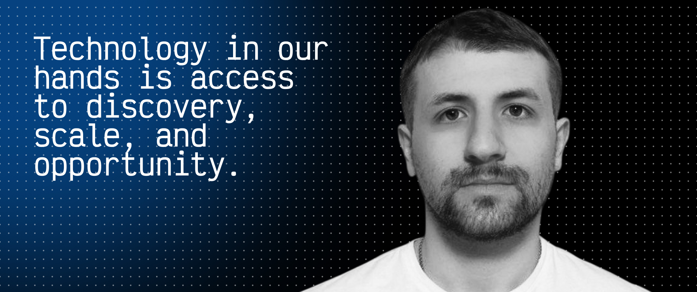

<!--
**r66cha/r66cha** is a ✨ _special_ ✨ repository because its `README.md` (this file) is present in your GitHub profile.

Here are some ideas to get you started:

- 🔭 Now I'm working on...
- 🌱 I'm studying now...
- 👯 I'm looking for cooperation...
- 🤔 I need help with...
- 💬 Ask me about...
- 📫 How to contact me: ...
- 😄 Pronouns: ...
- ⚡ Interesting fact:...
-->

## Ruslan Chukavin / r66cha

**Web2/Web3 developer** .

I am a developer who studies and applies a wide range of technologies - from server architecture and mobile applications to blockchain protocols and distributed systems.

I develop **open source projects**:

- **[Telescan](https://github.com/hiTechTeam/Telescan-info)** is a native iOS app for Bluetooth networking.
- **[Raketa](https://github.com/Open-Rocket/raketa_delivery)** - p2p service of tasks for people (delivery, trip, etc.)
- **[Bingo-Bongo Protocol](https://github.com/r66cha/Bingo-Bongo-Protocol)** - p2p offline deferred payment protocol in crypto.
